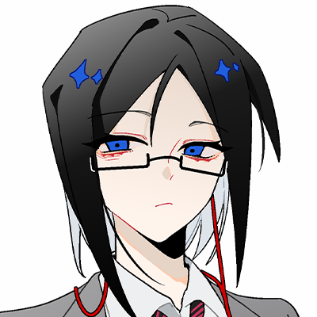

---
html:
    toc: true
---

# 本家(bg线)

> 总结：两个女人间的斗争，艾江利用爱着自己的男方实现自己的复仇计划。

## 人物，背景设定

### 艾江

女性，28岁，身高158，C+罩杯（？），中分半长黑发戴眼镜，宝蓝色眼睛。发尾偏碎，长度大概到脖颈，后期在本的要求下留长。
> 总体给人的感觉是又纯又御的。

黑客技能专精，擅长依靠黑客技术探寻各种人的情报进行卖钱当做收入，大多数情况下在暗网通过信息差赚钱，偶尔也会接一些（网络信息技术上的）黑活。

平时比较沉默寡言，比起交流更喜欢观察，凡事追求效率与最优解，如过有必要的话，不介意以身入局。

没有什么朋友，家人关系不好，因为各种原因（还没想好），自己几乎是被放养的关系。

由于在暗网上惹到了不该惹的人，艾江被药厂抓去物化当做玩具受尽折磨。
艾江在被折磨虐待的过程中认识了虽为药厂核心高层，但被头领忌惮警惕的成员：本。

在与对方相处的过程中，艾江尝试并成功策反了本，依靠对方的力量逃离了药厂，并尝试利用本的资源逐渐拉扯起一个和药厂绝对对立的组织，从头策划起一场以药厂为唯一目标的复仇。

### 本

男性，196，25岁，黑皮白毛绿眼，【眼睫毛眉毛也都是白色】骨架宽大但肌肉并不是很发达的程度，整体偏修长，平时都是笑眯眯的。

是药厂组织成员，组织里绝对的武力值第一，属于核心高层。

性格残暴但外表很难看出，平时都是挂着和善的微笑，善于思考，头脑转的很快可以在短时间内判断各种事态危险程度，看起来比较无害但在行为处事上最喜欢一点点的虐杀，极度可怕的存在。

恋痛，会有自残行为，也会有自杀倾向【目的是为了获得快感但不会完全致死】享受虐杀别人时对方的痛苦的模样，也会获得快感。

有毒瘾和性瘾。组织里有性交相关的活动【？】通常是最主动的那位。

总体是个精神不正常但脑袋很好用，武力值也非常可怕的危险男人。

由于本身性格非常随心所欲，情绪状态也很不稳定，难以控制，多次与药厂内部高层成员起矛盾冲突，并将对方残忍虐杀。
因此虽然因为武力值坐上了药厂核心的位置，但被头领忌惮警惕。

在药厂例行的福利日中认识了第一次被当做祭品的艾江，当时心情正好，一时兴起之下起了观察的意图，逐渐被艾江无论被如何折磨都依然坚强燃烧的灵魂吸引，逐渐起了独占的念头。
> PS：如果老师同时有写过本家(BL)线的
> BG线和BL线的主要差距有2点：
> 1.艾江身上解剖的伤痕：
> > BL线：艾江身上的解剖的痕迹，是本在最后的疯狂中，在艾江的身体上留下的
> > BG线：艾江身上的解剖的伤痕，是艾江在来到药厂后，由某个药厂的成员虐待留下的。
> 
> 2.艾江和本相遇的时间
> > BL线：艾江和本相遇是在艾江逃离药厂后，本因为艾江制造的爆炸烧毁了半边身体，在那之后，本以艾江作为的唯一猎物。
> > BG线：艾江和本的相遇是在艾江经历的第一次福利日中，本对艾江起了兴趣，并在之后协助艾江通过一场爆炸逃离了药厂。

本就像一个随时可以毫无牵挂消失的生命，他从来没有真正地拥有什么只属于自己的东西。在艾江主动向他靠来后，本拥有了第一个只属于自己的玩具，虽然这个玩具偶尔会被药厂的人抢走，但本认为艾江就是自己的。
而随着时间的推移，艾江也在逐渐向本强化这个概念，最终点燃了本与药厂之间本就存在已久的矛盾，得到本协助的艾江成功与本一起离开了药厂。

随着两人相处时间的加深，艾江对于本来说不再仅仅是一个独属于自己的玩具，而是变成了一种活着的意义，艾江看着本活在这个世界上活着的痕迹，是本的全部。
> 本应该也是愿意追随艾江一起付出生命的……或者更多可能的是希望能够带着艾姐一起走向死亡。

### 药厂

一个以贩毒做非法交易为主的组织，成员都凶狠且可怕。老大是个非常美丽的姐姐，有一个衷心的二把手XAN，一切重要决策都由女人下达xan传递。内部比较混乱但也算可控。

最终被艾江掀了老巢。

### 姐姐

没有人知道她的名字，通常被称呼为老大。看起来很有气质的美丽蓝发女子。
在她眼里药厂只是一个消遣的玩物。

### Xan

红发男人，黑警，其实是药厂二把手。是他将艾江抓进药厂，也是他发现艾江的小行为并惩罚了他。

## 故事梗概

因为某次委托中委托者的失误，导致2艾江被一个名为药厂的组织追踪到，本身药厂曾经就对这个黑客有拉拢之意，但因为组织拉拢的手段有些偏激（是试图定位到自己位置直接找上门），艾江感到被冒犯，反手把药厂信息摸了一遍后拒绝，且将调查到的药厂的信息卖给了敌对方，导致药厂损失惨重。

同样感到被冒犯的药厂对艾江的态度也转变成敌对。因不明缘由的信息泄露（我也不知道，总之是多方利益交涉下，个人的力量再怎么厉害也比不过拥有更多资源和手段的大组织），药厂的副手:一个名为xan的红发男人找上了门，并将艾江带走。
> 艾江的黑客技能算是最顶尖的一批，如果不是委托方被药厂抓捕得知了她的消息来源并且艾江少有的失误，药厂的人至今估计都无法知道艾江的位置，所以将她带回药厂，一方面是将其作为最底层的玩物惩罚她为药厂带来的损失，另一方面是为了让她给药厂打工。

艾江被迫加入了药厂组织，属于药厂里食物链最底部的存在。

成员们都或多或少因为艾江行为导致的药厂巨大损失让上层两怒火发在他们身上，而面对这个罪魁祸首，众人自然不会心慈手软。平时被成员各种玩弄调教，并让艾江利用技术为药厂收集敌对势力动向，整合处理暗网上的相关资源为药厂谋取更多利益。

> 一开始艾江不愿服从，会提供假信息，想办法制造对药厂不利的信息差，代价是被迫注射药物（毒品），折磨地丢了半条命，这也导致艾江染上药瘾。

艾江有单独的小房间，这个小房间永远不允许上锁，里面有摄像头监控艾江的一举一动。

而在组织后被成员们呼来喝去使唤，每天被物化被当玩具一样玩弄身体且自己无法反抗甚至还要依服。
> 艾江会经常偷偷服用避孕药【当着他们的面他们绝对不允许自己吃避孕药的】以防被这些人内射的过火导致怀上孩子，这导致艾江的身体受到了严重的伤害，怀孕几率变得很低。

因为药厂本就是进行非法行业比如贩毒，这里的成员或多或少本身都会有药瘾，他们会强迫在性事方面并不会积极回应的艾江吸毒，享受看她因药物影响被迫变得放浪的一面，然后再进行轮奸等行为。

平日大家都会比较收敛，毕竟艾江被抓过来本质上是要给药厂打工干活的，但药厂有一个非常特殊的活动，叫做“福利日”。
这个活动是专门给药厂里面的成员们释放自我的，那一天的药品每人都可以免费领取，（这也是药厂控制成员的手段之一），成员们不用顾忌药厂的大部分规矩，额能够随意凌辱玩弄被定义为组织最底层的人。

在艾江来到药厂的三个月后，艾江迎来了药厂的福利日。

在此之前艾江已经了解到了这是一个什么样的日子，她竭尽全力地寻找最大程度减小伤害地方法，最终她决定冒险向本寻求帮助。

那一次地福利日艾江几乎被本独占了（但是当众），但本身艾江精神坚韧抗压力很强，即便是被羞辱玩弄到身体条件反射的发抖，或者各种偏向重口的玩法将她搞的几乎晕厥也依旧没有过一次情绪上的崩溃。她的处理方式是一直隐忍，并抓紧一切机会寻找能够减少对自己造成伤害的机会。

在此之后，艾江成功成为了本的玩具，艾江表现的非常乖巧不会在反抗，不论是被本当众宣告占有欲地玩弄，还是在本不在的时候被其他成员们当玩具羞辱都不会有抵抗的情绪。
> 本知道艾江对自己并没有感情，只是想要寻求庇护，而自己也乐于为自己的宠物猫提供这样无伤大雅（在本看来）的帮助。

逐渐地，本将艾江视作自己独有的玩具，但由于药厂的牵制，本突然发现自己并没有完全地拥有艾江，本的情绪逐渐变得暴躁易怒，艾江看出了本的情绪，决定以自己为诱饵，将本策反，并将此作为向药厂复仇的第一步。
> 在药厂中，艾江的存在就是最底层的玩物，即使有本的独占（保护？），艾江并没有遭到过多人的欺凌。
> 但总会有本被药厂调开的时候，这种时候，每当本再次回到药厂，就会发现自己的玩具已经被别人动过了。

艾江逐渐策反了本，在本的协助下（小宠物向主人寻求帮助有什么问题）利用三年来偷偷递出的各种消息拉扯起的一个不大不小的，由药厂的敌对势力们构成的一张易碎脆弱的利益网，借力打力将药厂的老巢直接炸成废墟（暂不论如何实施，总之是利用了众多利益牵扯和外部力量，倾覆了药厂的老巢）将这里直接炸成废墟，大部分人都因此死亡。

>  艾江自己因为爆炸冲击导致了耳朵严重失聪，一个身位外的声音就听不清了，所以平时需要带助听器【红色形状的耳机】才能正常交流。 
 同时，本也在这场爆炸中为了保护艾江半边身体都被严重烧伤 

和本一起逃离药厂后，艾江在本的帮助下逐渐培养起来了一个能够和药厂对立的组织，组织里的成员大多是之前被药厂坑害过的有实力的人，又或是接着本曾经在药厂的人脉（或者说关于人脉的信息），再加上艾江自己的黑客能力，专门执行策略定点专项策反的药厂高层。
> 本在里面的作用主要是保护艾江，和为艾江提供曾经药厂的高层重要信息，招人主要靠艾江自己的能力（本懒得管），找到的人更像是艾江的亲信。
>
> 本知道有谁可能可以被拉拢被招揽，有谁和药厂有仇，艾则可以通过本给出的这些信息通过网络快速定位到这些人目前的状态，甚至可以了解到他们现在最缺最需要的是什么

艾江面对组织中的人更多表现出的是强势的大姐头的一面，但本从来不会遵守艾江定下的规矩，他会直呼艾江的姓名，在大庭广众之下对艾江亲昵或者忤逆艾江的命令，组织里的人都认为这是因为本深得艾江信赖的原因，都默认本是组织里的二把手。
> 实际上更像是艾江离不开本的帮助，她至今依旧很难控制住这只疯狗。

本看着艾江逐渐地成长，变得强势起来。

在私下里，两人相处时艾江依旧保留了强势的气场，但面对本的要求和行为不会有什么反抗或者是抗拒的行为，两人的相处方式依旧像是在药厂里一样，“宠物”和“主人”的感觉。

> 在药厂由于被迫注射染上药瘾，但逃离药厂后，艾江绝对不会让除了本以外的人知道她有药瘾。
> 本一旦发现艾姐有些不对劲就知道艾姐药瘾发作，艾姐意识到的时候也会……很需要本，让本帮自己掩饰。

艾江对本没有爱，但本不在乎，本只需要而艾江一直在自己身边，属于自己，顺从自己就可以了。

但艾江也离不开本了，她已经习惯被本占有，即使在复仇结束后被本囚禁（软禁，本不想艾江被别的人注意到关注到），艾江也没有不满，已经习惯本对自己的所作所为，没有大姐头时候的锐气，面对本就是自然的女性的状态。

