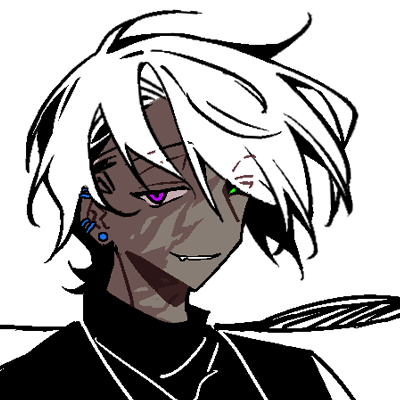

---
html:
    toc: true
---

# 三人组

> 注意事项：
> 三人组PA的实质上是【本 X 艾江 X 艾江】的故事，含水仙要素。
> 故事围绕着【暗网PA】和【本家PA】里的人物展开，其中涉及到的人物如下：
> 【暗网PA】：本，艾江（称呼为医生）
> 【本家PA】：艾江（称呼为小猫）

## 暗网

### 暗网-人物

#### 暗网-艾江（医生）

30岁，178，中分黑色长发男子。宝蓝色眼睛，戴眼镜但其实近视不深。
头发长度到大腿根，切面整齐，平时喜欢简单的束一下头发，内有宝蓝色挑染。

为人冷漠疏离，十分难以接触手很少正眼看人。

在此之前几年前是暗网有名的杀手。身手全国一等一，擅长瞬间爆发一击毙命，不管是近战还是远程，冷兵器还是热兵器都信手拈来。伪装潜行演戏也一样拿手，传言是个半长黑发，武器是伞的青年。总是喜欢杀完人后撑着黑伞悠然离去。曾经被多人通缉追杀，但结果均被他反杀。

后来似乎厌倦了杀手生活，从此金盆洗手不再接单杀人。反而是开始救人。

现在是一名外科手术医生，有自己的（黑）诊所，共两层，一层用来看病手术，二层是居住的地方，他的家。
> 其实医术很好，不管内外科都能看。

为了和过去割裂留了长发，头发内侧还加上看宝蓝色挑染。代表性的黑伞也收了起来，所以并没有人知道他就是过去的那个杀手。

有个亲妹妹（双胞胎），关系一般，但妹妹平时会帮着艾江收银坐前台，也会给艾江做饭打扫卫生等，因为自己哥哥会给很丰厚的打工【？】费，所以也很乐意来帮忙。
> 关于做家务这件事，本来后就不归妹妹管了，家务都是本在做。

清楚自己哥哥的背景但是并不在意。

> 虽然是个小诊所，但从来没人前来闹事，或者说前来闹事的都被艾江悄悄抹杀。久而久之大家都清楚这个诊所不好惹，是各个领地公认的中立区域。不管哪个组织的来到这里都不能闹事。他不允许自己的住所受到打扰。

除了正常的居民外，他也会救助不管什么势力的受伤人士。但对方将会欠自己一个人情。如果对方不愿意在艾江需要他的时候来还人情，艾江将会回来亲自收走对方的性命。

爱好打台球，几乎没人能比。在其他技术方面，计算机，乐器，艺术，数学，医学均有涉及且颇为深入，算是几乎全能型人才。
> 但在厨艺方面堪称地狱，不过自己完全不这么认为。

平时没有手术的话作息堪比老年人。十分自律，10点睡6点起。

习惯早上起来喝黑咖啡，尤其爱吃三文鱼。厨艺虽然很可怕但是刀功非常优秀。

某次意外接触到了曾经名声大噪，如今被内乱的反叛成员重伤的某黑帮组织头目:本。

艾江将他救下，因此和他开始有了逐渐倾向于深层次的接触。

#### 暗网-本

32岁 196，黑皮白发，瞎了一只眼，因那个眼眶没有眼球，是瘪下去的很吓人,所以一直带着眼罩防止吓到别人。是当地有很大势力个组织的黑帮老大。

看起来比较凶恶实际是个偏向于感性的人，虽然经常感情用事但是大事上还是十分理智的。

> 重感情，讲义气，是男妈妈。

当黑帮老大其实更多的是被迫。

从小无父无母只能靠偷窃和加入小黑帮有靠山来生活。这个小黑帮虽然是黑帮但是也额外的重情义，本很快的在这里有了归属感。

某次老大某次战斗中因突然的汽油爆炸，而本却第一时间先救了他，本自己却受了重伤，身体被烧伤一半，所以老大一直对本额外照顾。以及组织的人都对本很真诚，本几乎把这里当做自己的家。

随着时间的推移黑帮越做越大，本作为打手身手也越来越好，靠着经验和阅历做上了组织二把手，大家对此并无异议。他们都是同生共死的兄弟，也都知道本究竟有多厉害，毕竟论身手他可以算得上所有人里最强的。

而这个组织也开始逐渐成长。但是在刚刚起步，正被其他组织针对的紧张阶段，他们的老大因意外离世。

大家不约而同的希望本可以代替老大的位置，因为本的头脑也并不差，只是他衷心于老大所以很少表现出来。而这也是老大临死前嘱托的，希望本可以带领兄弟们渡过难关。

于是本坐上了老大的位置，而他也不负众望的让自己的组织成功跻身进当地有名的地头蛇之一。而本的名号也在暗网和灰色地带逐渐响亮。

但几年后，本的组织越来越大，人数众多且逐渐难以控制。外表看起来坚固不可催，实际内部已经被敌方缓慢的渗透瓦解。因渗透实在太过隐蔽且本忙于管理和处理组织大事，所以他并没有第一时间发现。而在本意识到的时候已经晚了。内部大乱，很快的就导致除了曾经过命交情的兄弟们外，其他人要不被杀要不投靠其他势力。地头蛇之一很快的被瓦解掉。本为了不让兄弟们也被杀，自愿当诱饵给他们逃跑的时间。

但最终，本的兄弟们也一一杀死，而自己也因敌不寡众最终受到重伤。腹部中弹肩膀也有刀伤，失血过多几乎快要倒下。

碰巧逃亡到艾江诊所的门口，遇到了出来透气的艾江，本想用最后的力气试图威胁对方，让他装没看到自己方便自己继续逃亡，结果反而被对方一记手刃干晕过去。

↑是个很惨的前黑帮老大如何和艾江相遇

### 暗网-故事背景

艾江救本并没有什么太多了理由，只是单纯觉得自己门口死个人不好看，于是救了。

其次才发现自己救的是实力很强很有名的黑帮老大，虽然前两天他的黑帮瓦解了。

艾江虽然已经金盆洗手，但是还是会用另外一个身份在外网偶尔挣点外快:比如搜集雇佣者要求的某组织资料，帮人窃取某人资料等类似的黑客行为。属于不自己动手杀人但是会间接帮别人做。

> 赚钱，不磕碜。

有的时候需要和受雇人见面碰头的时候,艾江都会让欠自己人情的人替自己去。除此以外还有一些需要人工收集情报的状态同样如此。而本作为实力派，艾江觉得他可以替自己做更多的事。

于是度过危险期醒来，发现自己在病床上的本收到了来自艾江的欠条，里面写了自己欠他一条命。

本本来就是重情感性的人。他既然活下来了，那他接下来的目标就是复仇，找到那些内奸杀掉替兄弟们报仇。

因此他也很感激艾江救了自己，即使对方完全不给自己好脸色【或者说即使笑也是冷笑或带有不怀好意的笑】并应允如果艾江需要自己随时可以回来帮忙。

> 十分重义气的人，对方欣然接受自己要求的模样反而让艾江不爽，但是不用多费口舌也是好事，既然本没有说能帮自己多少次，艾江决定无限次利用本。好用的工具不用白不用。

本也开始到处寻找线索资料，一点点挖掘哪些人是敌方的内应，什么势力来害自己组织的。因为他势单力薄，而且频频被艾江叫去干活，所以进展十分缓慢。

偶然一次本在替艾江跑腿时意外知道艾江原来是个黑客，就舔着脸希望艾江帮自己调查。艾江不想白帮忙，更加的使唤起本，并要求本之后还要帮自己做其他的事。而本除了偶尔抱怨几句以外也并不觉得不好，乐得替艾江干活，甚至在多次的和艾江接触后可以随意进出他的诊所了。
> 【经过这段时间艾江已经对本完全调查清楚和了解了他的脾性，也是个能守住秘密有原则的人，最终判定可以信任，能够成为长期合作伙伴，于是允许本进入二楼方便以后找自己】

本和妹妹的关系也不错，可以说本是融入了他们【？】

因为有了艾江的帮助，本的调查得已进展快速很多，他在几个月的时间内调查出大概的内奸数量范畴，并针对性的排查到了两个，经过筹划后找机会杀掉。接下来的他依旧准备慢慢找，越晚打草惊蛇越好。他是个很能耐下心的人，只要目标能顺利达成，他愿意做更加稳妥的选择。

也因此在这段时间和艾江的接触下，本逐渐了解对方的习惯和喜好，并且可以对症下药。
> 比如会帮对方做饭【见过艾江做饭一次被狠狠震撼到后开始主动接手下厨】
> 打扫卫生【艾江几乎不干，要不是妹妹看不过去帮忙打扫要不就是请小时工】
> 而本的家政能力也很不错【为了生存小时候什么都干过】
> 因此艾江默许了本的行为，算是和他形成了良好的关系。

在此之后又过了一段时间【两人认识半年后吧】艾江以前的一个合作伙伴.花高价拜托艾江帮自己调取某高档会所老板的资料，而这种资料那个老板从不会用计算机计算，全部手写秘密保存，因此需要艾江去窃取。

而会所并非简单的娱乐会所，因为有隐秘的黑色交易【例如吃人等更加血腥邪恶的行为因为太隐蔽所以只有深层会员才知道】所以安保监控以及内部布局安排都非常严密复杂。艾江思索后决定混入会员，进入顾客名单里，然后再行动。
> 当时会员是双人制，将会员打乱顺序然后随机排序强制被绑定的两人一起到场，不过可以带面具隐藏身份【会员之间会彼此警戒以防对方知道自己身份而不敢轻举妄动，这也是一种会所防止外界人混入的手法】因此艾江黑入他们系统，制造了自己和本的伪造会员信息，方便他们更好的混入其中，并要求本和自己一起去。并为此做起了准备。

当天他们是经过仔细筹划的【但是我没想】总之艾江打扮的偏向女性，他给本也化妆了一番【将黑皮画成白皮，发型也修改了一番】和本成功的混入会所内部。

艾江选中正好有内部活动的一天进入，更加不引人注目。

期间他要求本做自己的内应，自己找机会快速潜入老板房间找到了资料，并成功返回。但很快的他意识到自己被老板盯上。
> 或许老板非常熟悉这里的所有会员，所以一旦有陌生的人就会额外敏感。

老板在意识到有外人混入的时候就用上了混有肌肉松弛剂的香薰，且因艾江身姿很符合老板胃口所以额外还加上了高浓度媚药。

因此身为医生对药物很敏感的艾江很快察觉到不对，而因两人本身就有假面以及化妆遮掩身份所以最终选择赶紧突围离开。

虽然中间经历了一番波折，但是两人最终成功，甚至本还把老板杀掉了。

但在逃离过程中两人意识到:因为均吸入了不少媚药和肌肉松弛剂，而艾江因为更深入过内部所以吸取的更多，现在开始发作了。

艾江意识到如果不尽快处理这问题会影响接下来的逃跑，所以果断选择一个不容易被发现的小巷，强硬的命令本和他做，将时刻都可能爆发的性欲处理掉。

还是艾江主动直接的脐橙本，没有润滑直接插入。但是应该是天赋异禀，即使这样疼痛的情况下艾江还是会感觉到快感，而本也狠狠爽到，还被陷入情欲中的艾江深深迷恋。也是因为这次他才知道自己是爱上艾江的。

快速解决了性欲后两人也顺利逃脱，因为此次事件艾江似乎品尝到了性爱的快乐，于是和本之间又多了一层炮友关系。但是通常只有艾江想做本才能做的份，全程艾江也必须占据领导地位。

而本也理所应当？或者说并不是这么顺理成章的住进了艾的诊所。
> 因为在此之前本没有住所【以前一直就是住在自己黑帮总部，现在那个地方被其他组织占领了】,一直都是到处找便宜旅店住，有时候很凄惨的说不准直接睡诊所门口【……】
> 而艾江正好也有几个空房间，且目前和本的关系更近一层【合作伙伴+炮友】,本平时伺候他伺候的也很舒服【日常起居啥的】，所以给他个地儿住也不是不行。

于是两人就开始同居生活，但是其实平时两人的作息并不是很能靠到一起，艾江会因为看病手术等有时候忙到凌晨三四点不睡都有可能，平时作息也非常老年人。而本更偏向于正常人的【？】12点睡八九点起的作息，有交流但没有太多。

其实后面他们也没有什么大事，一直就是这么平静的共处。艾江帮本调查内奸，本负责找到内奸杀内奸，其余时间就是围着艾江转。就跟已经认了主的狗一样。

不过后来艾江确实是把他当自己的所有物了。

## 本家

### 本家-人物

#### 本家-艾江（小猫）

男性，176，中分半长黑发戴眼镜，宝蓝色眼睛。头发偏长到肩膀，平时松散的用皮筋扎着。

计算机，黑客技能专精黑客。

双性人，概率怀孕，介意自己身体残缺，所以相对比平常人更加自闭和精神不佳，封闭自我内心，

性子偏向直来直去，但是平时比较沉默寡言，不爱交流。擅长依靠黑客技术探寻各种人的情报进行卖钱当做收入，偶尔也会接一些（技术上的）黑活，通常在暗网接单。

没有什么朋友，家人关系不好，只有亲（双胞胎）妹妹偶尔能说几句话。自己几乎是被放养的关系。

因年轻气盛不懂收敛，做坏事爱留名（Hacked by Ayi），惹到了不该惹的人，被药厂抓去物化当做玩具，受尽折磨，在三年后找到机会炸了药厂老巢改名换姓重新做人。

艾江原本计划在接下来的时间里对药厂剩余的人一个个进行清算，但在某公司工作一年后，在他和手下黑皮白发新职员出去进行实地考察的工作后，他和那个叫做本的新职员就消失了，没有人找到他们。

一年过去了至今没人得知他们的下落。
> 实际上是被药厂余党本发现并抓走进行更加凄惨的酷刑。

#### 本家-本

男性，196，黑皮白毛绿眼，【眼睫毛眉毛也都是白色】骨架宽大但肌肉并不是很发达的程度，整体偏修长，平时都是笑眯眯的。

是药厂组织成员，组织里绝对的武力值第一，地位偏高。

性格残暴但外表很难看出，平时都是挂着和善的微笑，善于思考，头脑转的很快可以在短时间内判断各种事态危险程度，看起来比较无害但在行为处事上最喜欢一点点的虐杀，极度可怕的存在。

恋痛，会有自残行为，也会有自杀倾向【目的是为了获得快感但不会完全致死】享受虐杀别人时对方的痛苦的模样，也会获得快感。

有毒瘾和性瘾。组织里有性交相关的活动【？】通常是最主动的那位。

总体是个精神不正常但脑袋很好用，武力值也非常可怕的危险男人。

在艾江制造的爆炸事件中奇迹般捡回一条命，重度烧伤一半的身体，幸运地活下来后就在病态的寻找艾江的踪迹，将这个给予他永远会产生强烈痛苦伤痕的男人视为自己的猎物。

他恋痛所以会兴奋，但是他讨厌被别人留下伤痕。所以他想要让艾江也尝尝自己的痛苦，想看对方被折磨凄惨的痛苦神情。

最终他成功了。

#### 药厂

一个以贩毒做非法交易为主的组织，成员都凶狠且可怕。老大是个非常美丽的姐姐，有一个衷心的二把手XAN，一切重要决策都由女人下达xan传递。内部比较混乱但也算可控。

最终被艾江掀了老巢。

#### 姐姐

没有人知道她的名字，通常被称呼为老大。看起来很有气质的美丽蓝发女子。在她眼里药厂只是一个消遣的玩物，所以在药厂被炸，无法再恢复元气后她就放弃了药厂离开了。

#### Xan

红发男人，黑警，其实是药厂二把手。是他将艾江抓进药厂，也是他发现艾江的小行为并惩罚了他。在药厂炸毁后也消失了，似乎是追随姐姐一同离开。

### 本家-故事梗概

因为某次委托中委托者的失误，导致22岁的艾江被一个名为药厂的组织追踪到，本身药厂曾经就对这个黑客有拉拢之意，但艾江因当时孤僻自负，且组织拉拢的手段有些偏激（是试图定位到自己位置直接找上门），艾江感到被冒犯，反手把药厂信息摸了一遍后拒绝，且将调查到的药厂的信息卖给了敌对方，导致药厂损失惨重。

同样感到被冒犯的药厂对艾江的态度也转变成敌对。因不明缘由的信息泄露（我也不知道，总之是多方利益交涉下，个人的力量再怎么厉害也比不过拥有更多资源和手段的大组织），药厂的副手:一个名为xan的红发男人找上了门，意外发现小偷是个长相颇不错的纤细青年，且对方力量体能都无法于自己抗衡，所以在杀掉前有了想要先玩玩的心思。
> XAN发现这个青年双性人的秘密，并且将他开苞玩弄了一番【……】
> 惊讶之余感觉留他一命给药厂的成员手下们当玩具玩玩也不错，且本身艾江的黑客技能算是最顶尖的一批，如果不是委托方被药厂抓捕得知了他的消息来源并且艾江少有的失误，药厂的人至今估计都无法知道艾江的位置,所以将他带回药厂，以玩物的身份让他还清他导致药厂的损失。

XAN将艾江当着妹妹的面带回药厂（是示威也是警告）。

于是艾江被迫加入了药厂组织，属于药厂里食物链最底部的存在。

成员们都或多或少因为艾江行为导致的药厂巨大损失让上层两怒火发在他们身上，而面对这个罪魁祸首，众人自然不会心慈手软。平时被成员各种玩弄调教，并让艾江利用技术为药厂收集敌对势力动向，整合处理暗网上的相关资源为药厂谋取更多利益。

> 一开始艾江不愿服从，会提供假信息，想办法制造对药厂不利的信息差，代价是被迫注射药物（毒品），折磨地丢了半条命，妹妹遭遇车祸受伤，彻底老实了。

他有单独的小房间，房间里无时无刻都有看守监督他以防他做小动作，并借此机会揩艾江的油。
每天都在被成员折磨但因为需要他所以平日里并不会玩到失去工作能力的程度，也不允许在身上留下明显且会留疤的伤痕
> 【xan的命令，不过即便如此也有各种手段来折磨艾江】

可即使如此给艾江造成的伤害也是巨大的。本身身为双性人，这种身体上的残缺就已经让艾江对自我的认知偏向负面，被xan粗暴的开苞后已经让艾江承受的不小的打击。

而在组织后被成员们呼来喝去使唤，每天被物化被当玩具一样玩弄身体且自己无法反抗甚至还要依服，一直会被成员们强调是双性人的事并以此为乐，最喜欢在玩弄艾江的时候说一些羞辱性的词汇字眼，在被玩弄的没有力气后还要去进行工作。
> 他每天都偷偷服用避孕药【当着他们的面他们绝对不允许自己吃避孕药的】以防被这些人内射的过火导致怀上孩子，这也加深了他对自己身体残缺的痛苦。

因为药厂本就是进行非法行业比如贩毒，这里的成员或多或少本身都会有药瘾，他们会强迫在性事方面并不会积极回应的艾江吸毒，享受看他因药物影响被迫变得放浪的一面，然后再进行轮奸等行为。

平日大家都会比较收敛，因为还需要艾江干活。但组织里每月有一次福利日是专门让成员们不用顾忌这些，随意凌辱玩弄被定义为组织最底层的人。通常这天下来艾江总会被玩去大半条命，在这里每天都是痛苦的煎熬。

但本身艾江精神坚韧抗压力很强，即便是被羞辱玩弄到身体条件反射的发抖，或者各种偏向重口的玩法将他搞的晕厥也依旧没有过一次情绪上的崩溃。他的处理方式是一直隐忍，在其中寻找逃脱的机会。在别人偷闲犯懒的时候偷偷记录药厂的各种犯罪行为，然后试图找机会报告给警方。哪想警方里也有药厂的暗线，艾江被发现，这次真的被折磨到几乎死去，在床上躺了几个月才重新起身。

在此之后艾江表现的非常乖巧不会在反抗，不论是被成员们当玩具玩或者其他都不会有抵抗的情绪。在时间的推移中他逐渐开始获取到人们的一点信任【指不会无时无刻盯着他】，也为药厂谋取了大量利益所以地位并不是那么凄惨了【比玩物高一点】。在艾江入药厂的三年多后的某一天，艾江再工作期间服侍完一个成员后借口去厕所，在厕所进入之前就探查过的通风管道远离了大楼中心，

艾江利用三年来偷偷递出的各种消息拉扯起的一个不大不小的，由药厂的敌对势力们构成的一张易碎脆弱的利益网，借力打力将药厂的老巢直接炸成废墟（暂不论如何实施，总之是利用了众多利益牵扯和外部力量，倾覆了药厂的老巢）将这里直接炸成废墟【艾江是做好了和他们同归于尽的心理准备的】大部分人都因此死亡，而艾江自己也因为爆炸冲击导致了耳朵严重失聪，一个身位外的声音就听不清了，所以平时需要带助听器【红色形状的耳机】才能正常交流。

因不再信任警方和此次爆炸结果过于严重，艾江利用自身技术修改可能会查到自己的各种证据，以及盗取别人信息来掩盖自己的身份。在这之后的一年，艾江几乎完全闭门不出，一方面是以防被药厂余党追查，另一方面是在自我隔离戒除毒瘾。

本身精神意志坚毅的他最终用了一年时间成功戒毒，在经过慎重仔细的检查后确认安全后，就换了个城市开始新生活。

他不再闭门不出，或许是药厂痛苦的几年让他意识到了自我封闭的坏处，艾江转而开始过起了正常人的生活。他开始找工作，入职了某大型公司【具体是啥不重要】在里面发挥自己的优秀专业才能【计算机】并在一年后就因优秀升职到了（技术岗）项目总监的位子，同时继续在暗网上活动，只是经过3年的磋磨，性格更加收敛，手脚更加干净，变成了外层人根本没有听说过，但在技术核心小范围里非常有名的黑客。

某天公司入职了新员工，来人是黑皮白发高个男子。因露出来的一半脸被烧伤所以看起来很吓人，露出来的眼是紫色。另一半脸被头发遮住看不见，他自己说是因为这半边眼睛瞎了看起来很可怕所以才遮住。本的为人谦逊有礼十分得体，所以即使长得看起来很可怕也并没有让人产生排斥的反应，相反因为他学习东西很快工作效率也高，平时和人相处不错还很会说话让他很快的融入了公司的氛围。

新员工是艾江的下属，平时归艾江管。艾江虽然隐约感觉新员工有让自己不安的味道，但是也说不出个所以然。且新员工对自己也十分热络和善，虚心好学，最主要的是聪明，很多话说一遍就能懂（这样的下属哪里找）。即使有不对劲的地方也慢慢接受了。

大概过了两个月，某次公司安排让艾江带着新员工去另一个城市的分部进行工作指导。艾江开车带着新员工，路上经过一段荒野地段，结果一直沉默的新员工突然喊了艾江（此时用的还是假身份伊卡普）的真名，然后给正在开车的艾江看了自己手机，而手机里是艾江在药厂期间被凌辱折磨的视频。

>这个人是药厂里武力值最高的余党:本。他侥幸活了下来，但半边身体就是在艾江引发的爆炸中被炸伤的。
他曾经在组织里对艾是漠视的态度，只把对方定义为消遣。谁知就是这个玩具让自己险些死于非命。从此他久记念上了艾江，也一直在找艾江。
本的目的就是为了找到他，掌控他。每当想起艾江或者见到他，自己的伤口都会痛的让自己几乎无法维持伪装的和善外貌，遮住半张脸的目的就是不让艾江看到自己原本的眸色而察觉自己的身份。
他忍了两个月，终于找到机会让艾江体会到自己受到的痛苦折磨。

他折断了艾江的手腕，将他拖到车前盖上强奸，随后将其带回自己的密室。这个地方它精心挑选了很久，最终选定的位置让他确认绝对没有人能找到他们。

他将艾江囚禁在密室的地下室，每天羞辱折磨他，只是为了听他的惨叫和哀吟。他把艾江的手脚都折断，让他只能在地上艰难的爬行。他会对艾江实施比在药厂受到的还要痛苦几十倍的折磨，将他的身体玩弄的几乎没有健康的肤色，都是青紫或刀伤割伤烫伤。还有烟头烫出的痕迹，以及偶尔本兴致盎然而让艾江拥有的小尺寸弹药伤害。而这些伤害在有愈合的迹象就会被本再其基础上增加新的伤痕和折磨，导致艾江的身体逐渐拥有无法消除痕迹的各种可怕伤痕。

他也会在自己毒瘾复发的时候强迫艾江和自己一起注射毒物进行吸毒，让艾江不可避免的再次感染上毒瘾。

本经常强奸被折磨到这种地步的艾江，并且会非常兴奋开心，他想看到艾江的心理防线崩溃，会把自己其他的玩具（活人）带到艾江的面前剥皮解刨，将那可怜玩具的耳朵强行塞给艾江吃（因为艾江听力障碍）。但是他同样也会注意艾江的状态，防止艾江身体伤痕恶化生病死去。

不过很出乎他意料的，艾江的意志比他想的坚韧太多。即使无数次被本折磨的近乎崩溃，身体被破坏的尤其严重甚至会发出痛苦的求饶声，会做本要求他的各种羞辱行为，看到本就会条件反射的痛苦害怕ptsd，甚至精神状态差到极点，但他却能够靠着那意志强撑着活着，即使奄奄一息，经常大烧接小烧，伤口大溃烂接发炎…也依旧努力活着。

本能感受到艾江想要活下去的意志，所以他也知道为什么艾江会听从自己羞辱他的指示，去做那种物化或性化他的行为。

因为艾江心里一直认为:只要能够活下去就有求生的希望。只要活着，就能找到机会逃离或者报仇。

正因如此，本也更有想要折磨和玩弄他的欲望。毕竟玩不坏的玩具，总归是耐玩得多。

于是艾江就这样被本折磨，囚禁了一年多。

在这一年里，艾江被折磨到极为凄惨的地步。且这一年里本的精神状态随着拥有了艾江后也逐渐转换，从一开始的刻意避免艾江死亡，到后来发现艾江怎么都玩不死，且凄惨的模样非常能引得本的愉悦，他某天磕了药后精神极度不稳定的情况下下了个决定:他要看艾江是不是被解剖了也可以活。

或者说本认定了，在被解剖了的情况下艾江也不可能死，他是如此的顽强坚强，被自己各种玩弄都能坚持到现在，更何况区区解剖？于是他拿起刀，在没有给艾江打麻药的情况下，一点点的从艾江的锁骨位置一路往下到小腹，在正中间割开了一道口子，想要从中扒开观赏艾江的内脏。

这种痛苦是前所未有的，艾江几乎是爆发了本从没听过的凄厉惨叫。艾江的手脚被束缚他无法挣扎，只能看着血一点点涌出，被生生剖开的痛苦和从未感受过的极致痛感让他几次晕厥接近休克。他知道自己这次是绝对无法承受的住的，他这次是真的会死。

本也感受到了最极致的快感，他极致疯狂的研究和轻轻抚摸过艾江的肋骨，器官，看着血淋淋的人，期待艾江接下来醒来后一如往常的坚强活着。

## 三人组的场合

> 总之是因为某种不科学的原因，【本家PA】的世界线和【暗网PA】的世界线发生了相交。
> 【暗网PA】的艾江（在需要区分的时候，称呼医生），来到了【本家PA】的世界线里
> 【本家PA】的艾江（在需要区分的时候，称呼小猫），来到了【暗网PA】的世界线里

### 世界线相交

#### 本家-世界线

本的精神状态随着拥有了艾江后也逐渐转换，从一开始的刻意避免艾江死亡，到后来发现艾江怎么都玩不死，且凄惨的模样非常能引得本的愉悦，他某天磕了药后精神极度不稳定的情况下下了个决定：他要看艾江是不是被解剖了也可以活。

或者说本认定了，在被解剖了的情况下艾江也不可能死，他是如此的顽强坚强，被自己各种玩弄都能坚持到现在，更何况区区解剖？于是他拿起刀，在没有给艾江打麻药的情况下，一点点的从艾江的锁骨位置一路往下到小腹，在正中间割开了一道口子，想要从中扒开观赏艾江的内脏。

这种痛苦是前所未有的，艾江几乎是爆发了本从没听过的凄厉惨叫。艾江的手脚被束缚他无法挣扎，只能看着血一点点涌出，被生生剖开的痛苦和从未感受过的极致痛感让他几次晕厥接近休克。他知道自己这次是绝对无法承受的住的，他这次是真的会死。

本也感受到了最极致的快感，他极致疯狂的研究和轻轻抚摸过艾江的肋骨，器官，看着血淋淋的人，期待艾江接下来醒来后一如往常的坚强活着。

> 然后血淋淋的艾江在自己面前消失了。

也就是在这个时候，艾江消失了，然后本又看到了艾江。

不是那个衣不蔽体，状态极差，瘦弱疲态，被自己解剖开血淋淋几近死亡的艾江，而是干练且穿着得体的，漠然看着自己，甚至让自己能感受到极强危险性的……艾江？
真的是艾江吗？

要不是自己的玩具突然消失在面前，取而代之的是面前这个人，本甚至会以为艾江有双胞胎兄弟。

这个人即使长得和艾江一模一样，但在外观上，那长及大腿，内有蓝色挑染且切面整洁的头发，比艾江隐约高出一点的身高和比艾江健康有力的身体曲线都让本察觉，面前的这个人绝对不是自己的艾江。即便两人长得一模一样，但在气质上也是完全的天差地别。

而事实也确实如此。代替了原本艾江出现的来人，面对这种诡异的情况也并无丝毫慌乱。在沉默的打量了一番四周环境，最终视线凝聚在本身上，似乎是觉得他有点意思。可在上下打量了一遍后，便露出了无趣的神情，用行为表达了对他的不屑态度，嗤笑一声便轻易的弄断牢笼的铁门，悠闲的离开了囚禁艾江一年多的密室。

本无法接受这个人代替了艾江，或者说来人的出现让他失去了原本有趣的玩物，现在还想离开。他开始有些癫狂，他试图从这人身上夺回属于自己的那个玩具，或者说想让此人代替自己的玩具。

可结果让他更加无法接受。

因为他完全被这个和艾江一样的人全方位的压制。或者说对方面对自己时甚至没有用心。随意的一个反击都能给自己原本就沟沟壑壑的烧伤上留下新的伤痕。而很显然，对方也并没有想让自己活下来的意思，因为本能察觉到，对方想用虐杀的方法，一点点的将自己磨死。

男人在那个折磨艾江的房间里，靠各种痕迹判断出了本的行为习惯，于是他也用了本最喜欢的方法，去对待本。

这本是男人的无心之举，只是针对莫名其妙的奇怪穿越而增添的一点调味剂，但在本看来，他在被疼痛和快感刺激着，被面前这个顶着和自己玩具一样脸的男人虐杀时产生的耻辱和冲击感刺激着，对自己被用上曾经他最爱的杀人手法去折磨的不敢置信刺激着。结合起来得出的结论是:本兴奋到了极致。

他从来没有如此近的感受到死亡的味道，或者说这比艾江将他炸至重伤时更加接近死亡。他能感受到面前男人游刃有余的用一把银色的手术刀，随意的处理着自己身上肌肉的分离，将自己的生命力缓慢又坚定的抽离。于是他在自己死亡前，问出了他最想问的问题。

你是谁？

男人在本倒下后自然且随意的掏出手帕仔细擦拭自己的刀，他甚至白大褂上一滴血都没有浸染。本想离开的他在听到微弱挣扎的将死之人问题后回头俯视的看了他一眼。

然后在本咽气前的最后一刻，本看到了。

男人只是笑了一下，还是刚开始看到本时的嗤笑，然后本便再无意识。彻底失去了生机。

本永远无法知道这个男人究竟是谁，他也不会知道这个男人的过去有多令人闻风丧胆。他不敢相信这个男人是艾江，即便男人和艾江的相貌一模一样。

但男人确实是艾江。

是来自另一个世界的，曾经整个暗网几乎无人不知无人不晓的0失败率顶级杀手兼黑客。

随后，这个艾江便又凭空消失了。

……可本该代替他回来的那个凄惨艾江却并没有回来。

> 本家世界线在此便结束了

#### 暗网-世界线

在某次，本和艾江（医生）如往常一般，在诊所进行交流的时候，坐在本对面的艾江（医生）突然消失了。

就在本愣神之际，医生位置取而代之的是一具血淋淋的，被剖开的，已经奄奄一息的血人。

即便是本这种经历广泛的，猛的看到灵异现象再加这种血腥场景都有些震惊和猝不及防。他本以为这个人已经死了，可仔细一看那被剖开的胸腔中放于肋骨里的心脏还在微弱的跳动。

他立马反应过来这个人还有救。

本并不是心善的人。他在黑帮顶层的位置坐了很久早已见惯了生死，所以并不会同情心泛滥的随便有个人在面前就会救治。

……可是，他隐约感觉这被血浸染的看不清的面庞轮廓……很像艾江。

于是他决定紧急救治。

本来就懂一些急救手法的他一边紧急施救一边震惊这个人身上受到的种种伤痕。每一处都十分惊心动魄。

他也开始疑虑医生怎么突然消失，替代过来的人长得也像医生。一切都太奇怪诡异，无法用常理去形容。

而很快的，医生竟然又凭空出现，显得自然稳定，表情没有变化。

可另一个人却没因医生的回归而被传送回去。

医生看到被本紧急施救的濒死之人目光顿了顿。

他也看到了对方被本擦掉血迹，露出的和自己一样的长相。

于是他简单命令让本把对方抱上病床，自己给对方做手术。

手术时间长达十几个小时，而万幸的是医生救回了对方。虽然还没脱离生命危险可最危险的时期已经过去。

在等待和照顾昏迷的对方的时间，医生简单的给本说了自己的猜想:

医生救的那个人也是自己，但是是另一个世界的自己。医生被奇异能量传送到另一个世界，把自己和那边世界的艾江调换。而本是链接两个世界的纽带，应该也是艾江们会被传送的原因。而最后那边世界的本被医生杀死，所以这个艾江就无法再回去。可能之后他都会留在医生和黑帮本这边的世界。

虽说这种猜想实在过于离奇，可也无其他能解释自己为什么会凭空消失出现在另一个地方，遇到另一个本。而且传送回来后还能看到这个艾江没有消失，医生决定先观察几天。

而后这个艾江也确实没有消失，身体虚弱一直闭着眼睛躺在病床上，大概过了一个多月才醒来。

期间是妹妹一直在照顾艾江，本被医生勒令不许接近对方【因为看到过艾江之前的生存环境，猜得出是那边世界的本害他这样的】而医生则在调查艾江的各种信息，总之是一无所获。

妹妹也有意识到不对，面对这种出现了两个哥哥【？】情况她虽然好奇到并不过问，是让医生很放心的存在。【明明都是灵异事件了怎么还这么淡定←心态就这样，不然为啥医生能放心让妹妹管理医院】

在艾江睁眼后就被失去意识前濒死的极度痛苦惊惧包裹。缓了很久才逐渐察觉到自己还活着，以及自己面前站着的人。

那是和自己长得一模一样的人。

再对方简单的描述了情况后，艾江也立刻推测出面前的人是另一个世界的自己，也是他救了自己。

而既然是以本为纽带，那也说明这个世界也是有一个本的。

对本的恐惧和排斥让他一想到这个人就浑身发抖几欲呕吐。他有些想逃离，可自己的身体并不能支撑他起身。

然后面前的自己就用平静的，不可反驳的语气让他就好好呆在自己的医院里，不可以出去。

“我的身份比较特殊，你出去的话我很难保证你的安全。”

这个医生打扮的艾江的气场和行为举止都让他感受到了高不可攀的岩峰感，艾江意识到这个世界的自己并不一般。而基于同为“自己”的关系，艾江顺从的听取了医生的要求。

### 后面的故事

> 为了区分，接下来的描述以本（暗网PA本），医生（暗网PA艾江），小猫（暗网PA艾江），来进行人称指代。

对于医生而言，无论是小猫还是本，都是自己地盘上像宠物一样的存在（猫猫和狗狗），而自己则是整个地盘的主人，是拥有绝对主导权的存在。
> 本和小猫都默认了自己在诊所的身份。

#### 小猫对本的态度：恐惧

医生给小猫在诊所二楼的最里间安排了一个屋子，为其配置了一台能够联网的电脑。那个房间有一个独立的卫生间，和一扇永远拉上厚重窗帘的窗户，并在很长的一段时间里成为了小猫的安全屋。
除了偶尔医生出入以外，房间的门几乎没有被打开过。
> 这个时候本已经和医生同居了，本被医生安排负责小猫的饮食，但医生不允许本进入小猫的房间，因为小猫一见到本就会严重应激。

平常的一日三餐都是本放到门口旁边的一个小桌上，但白天几乎很少见到桌上的食物有动过，一般都是一晚上过去后会稍微有减少（小猫即使精神很差，但依旧习惯熬夜，昼伏夜出，和诊所另外的两个人相比是完全相反的时差），这个时候盘子里的东西都已经冷掉了。

#### 小猫对本的态度：逐渐脱离恐惧，但依旧不适应

考虑到小猫本来就处于刚从非常极端的环境中逐渐恢复的状态，而且一直闷在房间里不出来的话对身体和精神的恢复也很不好，本向医生提过这个问题，并提议需不需要监督小猫的恢复过程。
医生在思考之后，拒绝了本的提议，但给本提出了新的要求：医生需要本参与对小猫的（精神上的脱敏治疗），但前提是必须自己也在场的情况下。（因为现阶段如果让小猫和本独处，不仅没有脱敏的作用，还会加重小猫的病情）

> 对不起，其实就是想看3P夹心饼干。
> 长话短说，脱敏治疗是这样的：让小猫看到本，意识到，并适应本的存在 → 让小猫适应本和自己在同一空间 → 让小猫慢慢适应本靠近自己 → 让小猫接受本的触摸，抚摸 → doi → …… → 直到最难的和本对视，和本正常地交流。

脱敏治疗的全过程医生都会在场，或许是强迫地抱着控制着小猫，不让小猫面对本的时候下意识地逃跑，或者是坐在小猫的身边让小猫意识到主人在自己身边。

整个脱敏的周期非常漫长，但医生的存在对小猫来说有安抚的作用，只要医生陪着小猫，就可以循序渐进的让小猫慢慢对本脱敏。

#### 小猫对本的态度：不信任，怀疑

小猫的活动范围逐渐回归正常，但也只是扩大到了诊所而已，并且一般情况下还是呆在自己的房间里上网（网瘾很大.jpg），属于是白天睡觉，晚上熬夜上网（通过网络迅速了解这个世界+回归老本行），饿了就半夜自己跑出来翻翻冰箱看看有没有什么吃的（一般本会根据医生和小猫的喜好在冰箱里留一些零食甜品之类的），偶尔也会撞上半夜回来的本，往往这个时候小猫会匆匆地转身就回了自己的房间。（因为即使已经不是非常害怕本了，但还是不愿意和本单独相处）
> 本：【话都没说出口】。
> 本看到明显变得紧张了的匆匆离开的小猫，会感觉到又可爱又觉得有些挫败。
> （本：怎么才能和对方搞好关系呢……）

但即使是这样，本也不会可以找机会和小猫独处去逗小猫之类的，因为本不想让小猫紧张害怕，即使想要和小猫打好关系，本也会先问医生可不可以，医生觉得可以才会去。

再到后来，医生感觉到小猫已经不会因为本的存在和行为而应激，允许了本和小猫单独接触，同时也将那些需要利用黑客技术的活交给了小猫来做。最开始本其实是不愿意去和小猫接触的，因为对方看起来根本不想和自己待在一起，相比对于自己的需求也不会很积极的响应。
结果没想到小猫的效率非常高，而且各种调查都做的很详细很仔细，大大提高了本针对仇家的清算速度。
> （主要原因：对于医生而言，响应本的需求完全是看自己心情，想搞就搞不想搞就不搞，所以有时候帮本调查仇家的速度很快，有时候又半个月没回音；而对于小猫而言，虽然说是帮本的忙，但这也是医生交给自己的任务，所以小猫一定会认真负责地去完成；还有一个原因是每次小猫都不想和本多呆一会儿，所以想要提高效率速战速决，搞定了就把本赶出自己的地盘）
> 本：好好好（
> 结果导致本更加频繁地去找小猫帮忙，小猫不胜其扰。

随着和小猫接触的时间变多，本逐渐也了解到了这样一个和医生完全不同又相同的艾江，在逐渐觉得有意思，喜欢的基础上，也会觉的心疼，所以依旧在平时的相处上会保持让对方能够感觉到安全的距离（真实男妈妈）。
> 小猫由于身体上已经拥有了太多不可逆的创伤，即使已经逐渐恢复，并且被本“养”的越来越健康（从瘦骨嶙峋到逐渐有肉），但很多后遗症已经留下来了。
> 比如没有办法长时间地集中精神，精神状态不好，手指会有时候不受控制地发抖，无法抓握，长时间使用键盘会很容易手累（所以自己惯用的键轴都从原本喜欢用的青轴换成了克数最轻的）之类的。
> 对于这种状态，小猫心里的骄傲其实是无法接受的，但同时他自己也很清楚能够有现在这个状态已经是奇迹发生捡回了一条命了，当有外人在场（比如说本，或者是医生）的时候，小猫只是会楞一下，然后平静地把掉在地上的笔捡起来。
> 但是当没有其他人在场的时候，小猫会对着掉在地上的笔/或者是自己的手，发呆很久……

小猫在克服了对本的恐惧后，对本的存在一直是质疑和不信任的，他认为这个人表现出来的一切只是伪装，他死乞白赖地呆在诊所一定是有所图。虽然医生足够强大，不用在乎这些，但小猫也不想让一个别有用心的本留在医生身边，所以在这个过程中小猫一直围绕着本进行调查，甚至在医生某次长时间不在诊所的一段时间里给本身上安装了窃听器。

> 这个行为被本发现后，本被激怒，一方面是感觉到自己一直以来的好心和忍让都被猫吃了（？），一方面是感觉到被冒犯，感到小猫没有认清自己的地位之类的。
> 到底谁才是这里（打扫卫生做饭家政）的主人（猫狗吵架）
> 总之是抓着小猫狠狠吃了。

医生回家的时候小猫已经处于是一个被本随便摆弄，没有什么精力反抗的状态了。
医生一方面是早有预料的表情，一方面是感觉真是不堪入目。
命令本把诊所收拾干净后，医生决定先回去住一下别的地方。
>（类似于一回家发现家里狗狗把猫猫舔的浑身是口水，根本不想撸）

#### 小猫对本的态度：不和

被草后艾更加不愿和本接触，经常锁门闭门不出，躲着本的行动走，如果不是医生在这艾被草了后应该就直接跑了也说不准【。】因此医生应该也有教育本【类似轻描淡写的说：他没安全感，你需要慢慢来】本茅塞顿开，开始尝试多次主动接触小猫。
> 这样的相处不仅没有缓和两人的关系反而变得更紧张了！！唯一的好转的点或许是小猫不是那么害怕本了。

随着相处，小猫和本之间的矛盾（主要是小猫单方面对本的）逐渐开始摆在了明面上，但这个时候小猫已经敢于直视本，敢于正面面对本，会经常性地爆发争吵（主要是猫猫哈狗狗，狗狗委屈.jpg）。
对于这些小摩擦，医生一般懒得管，而且本也乐于看到小猫逐渐向着好的方向恢复。

