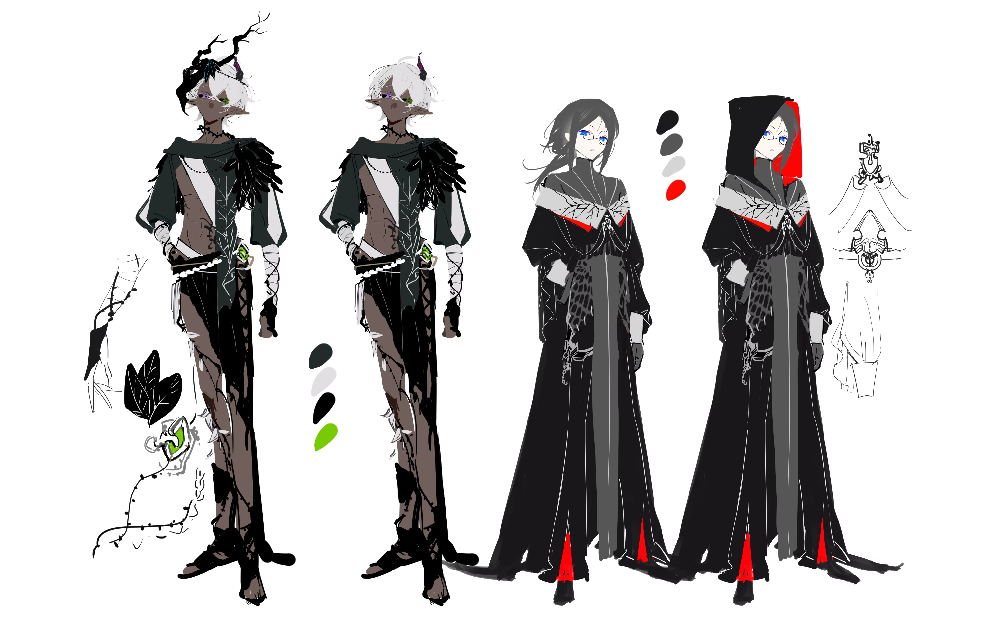

---
html:
    toc: true
---
# 1. 世界观设定

## 1.1 力量体系

### 1.1.1 神明
从性格，主要掌控的能力来划分，神明可以分类为主神和邪神。
主神们创造了世界，他们的目的是为了维护世界的稳定，世界的正常运转，大多各自拥有自己的眷属，也愿意回应自己的眷属，为眷属降下祝福，回应眷属的请求之类的。
邪神们的来历无法追溯，他们的各自有自己的目的，但大多数目的都会对这个正常平稳运行的世界造成干扰或者破坏。他们无法揣测，行事准则也很混乱，被主神，被世界排斥。

> 世界观里主要涉及的两个神明：
夜行者：邪神，通常回应充满着强大的恨意与仇恨的的祈求，较为神秘的存在，是艾江第一个签订契约的神明
繁源：主神，主掌着生育与繁衍，也掌管生物的创造，偏爱自己的造物，几乎只回应自己眷属的祈求。暗精灵是她的眷属之一，但人类不是。

几个主要的主神：

地脉（自然和大地）（Terrestrial）
叙事诗 （历史与时间）
金辉（黄金和光辉）（Aurelia ）
夜界（夜晚和隐秘）（Junoctus ）
星合（星座和天象）（Geminis ）
启明（光明和启示）（Luminex ）
繁源（生育与繁衍）（Nexaera）
海霭（大海和生命）
裁决秤（规则与公正）（Justis ）

#### 1.1.1.1 暗精灵的神（掌管繁衍）

### 1.1.2 职业

#### 诅咒术士

非常稀少的一种职业，除了极北之地几乎没有这样的职业存在。

通过与神明签订契约，从而能够借用神明（或某种特定信仰）的力量的一种具有古老传承属性的职业（一般都是传承制，对应的家族在相关知识的态度一般都是私有，排外，不对外开放），通常的施法方式都是通过仪式向目标降下诅咒，由于其职业特性，是被生来排斥的一类人。

作为法系职业，仪式是很普遍使用的一种法术，它能达到的共享包括治愈，攻击，防御，日常等等。
> 仪式通常包括演算阵、引子、和合适的祭品（诅咒术士特有）。
> 演算阵:仪式最基础的构成，用合适的颜料在合适的载体上绘制的阵法。
> 1.颜料决定了仪式的响应速度，威力大小效果好坏。常见的颜料有动物的体液血液，宝石或金属的粉末，植物的汁液等组成；
> 2.载体决定了仪式的稳定程度，启动时间，持续时间。常见的载体有纸张，骨头，石板，金属，动植物的皮等至少可以在仪式完成前稳定存在的平面。情急之下在地面上甚至是自己的皮肤上完成一个小型而快速的仪式是法师们经常干的事。
> 3.阵法的绘制方式几乎决定了包括或未包括上述属性的仪式的一切，最主要的是阵法的绘制方式决定了仪式指向的具体的存在，是否要唤醒它，它被唤醒的方式，要使用的权柄是哪个方向，如何使用权柄对应的力量等。
> 引子：启动仪式的必需品，可以看做是启动仪式的钥匙，常见的引子包括药草，纯净的水，蕴含着能量的晶体等，千奇百怪什么都有。
> 祭品：一般是诅咒术士使用的诅咒类的仪式中特有的组成，用于确定被施与诅咒的对象，可以是对方的头发，常年贴身佩戴的物品之类的，这也导致诅咒术士可以在很远的距离咒杀自己的目标。

#### 德鲁伊

待补充，但是参考一般设定下可以变猫猫狗狗熊狼虎豹的德鲁伊

## 1.2 政治与社会

### 1.2.1 极北之地

传说是距离神明的居所最近的地方，这里盘踞着许多古老世家

#### 1.2.2.1 种族
人类
游魂（没有实体的一群发光粒子一样地生物）

### 1.2.2 地底

#### 1.2.2.1 种族
暗精灵（母系氏族）（精灵族的一种种族分支）
地底矮人（矮人的一种种族分支）

### 1.2.3 海
塞壬（兽人的一种种族分支）

# 2.人物设定

## 2.1艾江
男性，176，中分半长黑发戴眼镜，宝蓝色眼睛。头发偏长到肩膀。身材偏瘦弱
沉默寡言，全靠着复仇支撑着去行动的人。

出生于极北之地，某支古老的诅咒术士家族，说是家族，但实际上只是一个不到十人的小家族。
艾江的父母原本打算在这一代结束诅咒术士的传承（类似于金盆洗手，转行，总之就是没打算让艾江继续当诅咒术士，因为诅咒术士这条路子大多都是不是很阳光，血腥且被排斥的），但是在艾江10岁那年，艾江的家族被仇家（另一个诅咒术士的家族）灭门，父母为了保护艾江死在了诅咒的火海中。
从这一刻起复仇成为了他唯一活下去的动力，艾江的决定做出的很果断，他亲手以父母的尸体作为祭品，以自己的血液为引，在有限的知识里祈唤了众多神灵后，只有【夜行者】回应了艾江的仪式，为了不失去仇家的踪迹，艾江趁机使用【夜行者】的力量，通过亲人们尸体上遗留的仇家的诅咒法术，反向在施咒者的身上留下了一个浅淡的追踪痕迹（除了越靠近目标，艾江会有更明显的感应以外，这个仪式没有任何别的作用），并自此开始了变强，复仇的道路。

艾江明白自己现在太弱了，家中的书籍和知识也被仇家抢夺或是焚毁，他启程离开家乡开始四处游历，一边收集知识进行学习，一边搜寻仇家的踪迹。
> 由于仪式使用的材料大多都是炼金产品，所以一个优秀的诅咒术士通常也是一个优秀的炼金术师，艾江原本被家里安排的以后的路子是走炼金术士这条道，所以艾江的炼金术非常优秀，这也是他一路游历路费的来源
> 但同时，仪式的使用又非常消耗材料，尤其是一些珍贵的材料价格非常昂贵，所以艾江平常在衣食住行上都是能省则省。

艾江实际上是个非常有天赋的诅咒术士，或者说他对仪式的知识非常敏感，但即使是这样，在进步非常迅速的情况下，艾江还是觉得自己太弱了。
在某天开始的时候，【夜行者】对仪式的回应开始慢慢变得时有时无，变得愈加断断续续。神明是无法理解也无法沟通的，艾江不知道原因，但他需要做出更多的准备。
为了变得更强大，也是为了避免在关键时候无法启动仪式，艾江开始逐渐尝试与复数的神明签订契约。

与复数的神明同时签订契约是很危险的事，因为与神签订契约基本上都是要付出对等的代价，（三心二意的样子）也容易引起神明的不满，尤其是诅咒术士更多是与邪神签订契约。
在几乎全部自学的基础上，艾江开始对仪式开始优化和改写。
优化是为了让一些准备时间很长的仪式变得可以长久持续地稳定地保持在即将被触发的临界状态，从而达到一个有需要时可以瞬间触发的效果。
改写则是创造了一种新的使用仪式的方式。

> 艾江创造的特有的仪式主要是混淆。
混淆：混淆神明定下的法则，偷偷地借用神的力量，向原本不愿意施与庇护的特定神明索取力量。例如通过使用龙族的血液或脱落的鳞片作为祭品，混淆了法则，从而可以利用人类的身份借用龙族信仰的力量。
但这样的行为几乎是在窃取神的力量，或者是其他种族的信仰，如果被神注意到，则是一件很危险的事（脾气不好的神可能会降下惩罚）

也因此他也开始尝试更加危险的法术：在混淆的基础上，仪式能够做到的能力和强度变得更加多样化，最主要是可以给予艾江低成本高强度的自愈和自爆法术，以此来更高效的获取和献祭自己的力量。
因为在此之前他发现正统的献祭/供奉事物来获得的力量通常是高成本低回报，并且很难支撑自己去进行接下来的复仇和变强。
邪神喜好献祭者同类的血肉尸体等，献祭这类东西得到的回报会高很多。但艾即便是心死之人（他的心里只有复仇的情感，是打算复仇完后，就结束自己的生命），除了复仇以外没有其他念想，他也不愿伤及无辜之人的性命来达成自己的目的，所以他决定对自己下手。
之前他会割腕等轻度自残方式来给予邪神自己的血液辅佐其他事物获得力量【或者寻找仇家的路上遇到主动攻击他，对自身有威胁的人的尸体用于献祭←艾江只是不愿无理由的杀人，但是有人要杀自己，他会毫不客气的杀了对象并将对方的身体用于仪式】

> 艾江在几乎自己的全身都刻印下了各种各样的仪式（有些是在皮肤上，有些是在骨头上），并通过优化阵法的绘制方式将其保持在了一个随时可以启动的状态，在关键时刻可以牺牲自己的身体（作为祭品）瞬间启动仪式。
> 例如以左臂连着骨头炸成血花为代价，换取一个大范围的杀伤性仪式，或者是以一只眼睛为代价，启动一个稳定的瞬间传送仪式之类的，总之是缺胳膊短腿挖眼睛是常事。
> 艾江也会将一些小型的仪式刻印在一些石板或者是宝石上，或是将一些可以用作仪式的敌人的尸体等封存在琥珀等材料中，通过炼金术将其维持在一个几乎已经触发的状态，当作为载体的石板或者宝石被毁坏时，其上承载的仪式就会瞬间释放。

于是在他创造了混淆的仪式后，他可以更方便的将自己的身体用于仪式的献祭，并混淆神明来获取更强的力量
【比如之前艾江需要用敌人的血液+各种药草才能换取给予敌人带来暂时失明的能力（只针对目前的目标，还是一次性的），但是通过混淆，借用了复数个专门司掌该方向的神明的力量后，这个仪式可以瞬间将敌人的五感摧毁（如果敌人强，法术也会被削弱）】
而艾江会做的更加极端，他会献祭自己身体的不同部位来获取不同的能量，眼球，舌头，耳朵，指甲，手指，四肢等等，都会用于仪式来获取强大的力量。又因为他在自己的身体上刻印下了超强的自愈能力的仪式，这完全能够支持他自给自足。
因此对于艾江来说，疼痛是非常正常的事情，甚至因为这种事情做的很多，他开始麻木于疼痛，可以面不改色的挖眼球，断手臂等。也因此他的皮肤会显得比较苍白，也是因为身体常年处于贫血的状态。

## 2.2本
本，暗精灵，身高196cm，年龄153岁
白发黑皮，眼白是黑色，异瞳【一绿一紫】
贱兮兮的不安分的德鲁伊，喜欢变成乌鸦趴在艾的帽檐上
#### 精灵和暗精灵
暗精灵和精灵族不同，虽然都是精灵【长耳朵，身体修长，亲近自然，无需进食，靠吸收自然界的魔法元素生存等特点】但暗黑精灵是比精灵更稀少的存在:比例大概20：1
和精灵不同的是他们的皮肤都是深色，眼白是黑色，眼瞳是异色【一个是夜视能力的眼睛】以及头上有一个黑色的角。
他们和精灵族的关系实际上也并不融洽。虽是同种族，可精灵族却拥有着强烈的种族阶级意识，排斥且厌恶暗精灵。
>因暗之精灵是繁衍之神的子嗣，而精灵信仰的是代表智慧的神【信仰里智慧觉得繁衍是凭借本能所作出的行为，是不经过思考的，这让智慧觉得低下且愚蠢】。
再加上暗精灵无法吸收正常的魔法元素，能够维持他们生命的是暗元素。而暗元素作为世界上较为稀少的魔法元素，所能出现的环境也只会是黑暗，充斥着亡灵和死亡的地方。擅于使用暗元素魔法的人也通常都是邪恶的。这也让吸收光元素的精灵觉得他们劣等邪恶。

暗精灵的角随着年龄的增长也会逐渐变长【长到一定程度便不会再长】是暗精灵身上最重要的部分。这个角可以储存暗元素【以备自身虚弱的时候应急用】，也是非常珍贵的药材。一旦暗精灵的角断了，自身也会元气大伤【受伤严重】需要恢复很久【但是角可以慢慢长回来】一般暗精灵的年龄可以通过角的颜色来判断：成年的暗精灵角的颜色是纯黑【角的纹路是紫粉色】年幼的角是淡青色【纹路是蓝色】
所以相对比精灵的栖息地，他们生存的环境也因客观【存在高浓度暗元素的地方很少】和主观【被精灵族排斥】的原因被压缩到了很小的范围。

暗精灵族群大部分都在一个名为深渊的地下深处。还有少部分是在其他的黑暗环境生活。
那是一个长达几万米深的大峡谷，峡谷底部究竟是什么样很少有外界知道。而暗精灵一族就生活在峡谷的底部。峡谷里充斥着浓郁的暗元素可供各种不同的暗之生物生活。不同的深度有各种不同的深渊生物，越往下深入生物的外表和习性就愈加不同，因此也越危险。【参考深海生物】
暗精灵们常年和这些生物厮杀搏斗，自身苛刻的生存条件也让他们常年保持戒备之心，也因此他们不会自诩高贵，性格也和优雅的精灵相比更豪爽洒脱，生性也显得残忍。
和逐渐退化视力的深渊生物不同，暗精灵拥有着很强的视觉，夜视能力和听觉。虽然地底永远都是黑暗的，可他们却可以依靠这些能力更好的在深渊生存。他们虽不用进食【闲的没事想吃几口饭也没问题】，但却需要深渊生物的皮毛或身体组织来强化自身【或做装备】所以平时也会组织族人去进攻深渊生物。再加上本身是繁衍之神的子嗣，恢复能力也很强，所以他们在深渊生存的很好。
>精灵通常是独居，不过彼此之间是有联系的。但暗之精灵则是群居，因他们生存的环境更加危险，所以即使本身实力会比精灵强但是却很团结，所以他们对待同伴的感情也会比精灵更加深厚。

而作为精灵种族里的暗精灵，本却有着一颗放荡不羁爱自由的心。
本153岁【精灵年龄通常可以到一千岁左右】和其他暗精灵不同，他从小就不安于深渊里这样长久往复的生活。他看过了书，了解了一些深渊外面的世界，开始向往外面的环境和文化。
通常暗精灵为了生存，所选的职业都会偏向高伤害的物理职业。本身深渊暗元素浓厚，除此以外的魔法元素就少得可怜。他们也很难选择法师这种职业去战斗【因为只能放暗魔法】而本却是异类，他选择当偏向法师的德鲁伊，因此还被自己的族人念叨了很久【因为暗精灵人数少，每个都是不小的战力】但是本变成各种深渊生物来辅佐族人，族人逐渐也就接受了这样的本。
可是本生性耐不住寂寞【从选了不太适合在深渊生存的德鲁伊能看出】决定离开族群去深渊外面看看。族人听说后表示强烈的反对。本不听【我爱干啥干啥】在忍耐了几十年后，毅然决然决定去外面看看。
他变成了会飞的深渊生物，一点点的往深渊上层前进，期间也遇到了不少的生物攻击以及受伤等情况，但是他机敏过人，也凭着那股要出去的劲，前进了大概一个月才真正的离开了深渊。
然后他发现外界的暗元素少的可怜，几乎等于没有。
外出探险的第一步就遭遇挫折，本差点一头再钻进深渊。但是他还是决定离远些看看，毕竟暗精灵并不是全族都在深渊里生活，还有少数是在其他符合他们生存条件的地方生活的。
说不准就遇到那种地方了呢？毕竟自己还有角里储存的元素来维持一段时间。
本这样想着，开始了自己的地上探险时光。
在此期间他看到了自己再深渊从来没看过的，鲜艳的颜色和各种各样让他惊叹的东西。他发现了很多的生物，也见到了很多其他种族。风景，蓝天大地他都觉得很好看，他也发现在地上，人类是遍布最多的物种，他们的食物本很喜欢吃【即使暗精灵不用进食，但是吃到了人类的美味食物让本觉得可以满足口欲也不错】。他最喜欢变成一种名为乌鸦的鸟类，因为乌鸦贱贱的，他发现可以用乌鸦的身体去“袭击”人类的食物摊位，人类只会骂骂咧咧几句，并不会攻击自己。
可是这样的好日子并没有几天，他很快就躺在地上奄奄一息。
他的暗元素要用完了。
就在这时候，他突然感受到一个身材偏向娇小的人类身上散发出他极为熟悉的气息
那是暗元素的气息。
已经没有多少时间的本最终决定冒险去接近那个人类，这样至少比饿死强。

# 3.故事背景

在一次旅途中，艾江与本相遇了，那个时候艾虽然身上穿戴有遮盖自身气息的服饰（可能是面具之类的），但身为暗精灵，本对黑暗的气息非常敏感（毕竟这是他赖以生存的能量，有点类似植物需要阳光进行光合作用），所以本当时就变成了乌鸦一直跟踪着艾江，想要找机会和艾江贴贴吸一点黑暗气息（要不然真的就快要饿死了）。

本作为乌鸦跟了艾江一路，艾江在野外的时候，本就会落在艾江头顶的树枝上，艾江在城镇里的时候，本就会落在周边的房檐上。本越来越大胆，仅仅过了3小时【可能本的能量要撑不住了】当艾江在溪边洗漱的时候，本落在了艾江身边的脚边，结果艾江头也没抬就一把抓住了本，他把本（乌鸦）按在了水里，本情急之下想要变回精灵的样子，结果发现自己变不回去了（被艾江释放了一个小型的阻断魔力回路的仪式，对于这种小型野兽非常简单好用）。
艾江把本按在水里按了一会儿，然后拎起来，问本一路跟着自己要做什么。
> 乌鸦浑身湿漉漉的，张着嘴半死不活地嘎了一声。
> 艾江：我知道你能说话。
> 艾江：你是精灵吧？德鲁伊？
> 本：
> 艾：说话。
> 本：……饿…………

总之是经过了一番交流（和喂食），本表示自己想要和艾结伴同行，艾对此没有同意也没有拒绝，总之是一个默认的态度。随后艾解开了本身上的仪式，本变回了精灵的样子跟在艾的身边两人一起踏上旅途。
> 虽然本没有告诉艾自己是想要留在他身边吸黑暗气息，但艾其实是知道本的目的，只要本不干扰到自己，艾江不是很有所谓多一个人跟在自己身边。
> 另一方面，本身为暗精灵德鲁伊，其实他身上的很多部位（？）都是珍贵的炼金/仪式素材，例如暗精灵头上的角，暗精灵的血液，暗精灵德鲁伊变成的动物所掉下来的羽毛，鳞片之类的。几乎可以视作是一个移动的素材库。有本在，艾江省下来了很多需要购买或者是到处寻找的素材。
> 并且本身为暗精灵，暗精灵信仰的繁源之神主掌生育和繁衍，（可以理解为增殖、增生、恢复、生命相关的能力），本的恢复能力很强。
> （所以经常会有艾江把本变成的动物按在地上拔毛拔鳞片（？）的场景出现）（本【惨叫】）

在旅途的过程中，两个人对彼此的认识逐渐加深（极端的e人和极端的i人），艾江几乎不怎么说话，而本则很喜欢哔哔叭叭（比较贱兮兮的性格），本很喜欢变成乌鸦站在艾江的帽子上或者肩膀上，在艾江的耳边和艾说话，艾江不理他他就去叨艾江的耳朵或者衣服上帽子上的宝石，艾江想要抓住它塞进包里，但是本又在艾江伸手的时候飞走了。

本通常不参与艾江的战斗，但是每次看到艾江自毁型的战斗方式都会躲在旁边的树上震惊的咋舌。艾江对于本不来帮助自己的情况也毫不介意。
>某次看到艾江自爆了自己的双臂去杀掉敌人后，面色苍白但平静的用嘴咬着布条熟练地给自己包扎伤口时，本忍不住感慨
本：有时候感觉你比我更适合生活在深渊
艾江：【头也不抬】如果那里的环境能够更好的辅佐我达到目标，我也不介意在里面生活。

大部分时候两人的相处方式还是以搞笑【本】居多

艾江在集市上买材料的时候一般直接问价付钱走人，无论价格是否合理，只要自己需要并且能够买下，艾江就会直接付钱买。但是有一次当艾江想要买一个价格远高于正常价的材料时，站在爱江肩膀上的乌鸦本突然开口说话和老板讲起了价格，并成功把价格砍到了一个很美妙的低价，艾江感到很惊讶，像是发现了本作为素材库的另外一个新用途。
> 老板也很惊讶，毕竟会说话的乌鸦很常见，会讲价的乌鸦确实少见。

虽然本那个时候讲价只是一时兴起，但是后来每次艾买东西要是觉得贵了（但是又很想买），就会默默地站在摊前等本和老板讲价，有时候本装作听不见（本：【不服】凭啥你让我干活我就干），艾江就会抓着本（乌鸦的样子）把本按在自己想要的炼金素材前面……（老板：什么？是要拿这个鸟换吗？）
所以后来艾江还研发了一种把德鲁伊强制变成动物的仪式用来强制本做事。

艾江一路收集各种仪式的素材，一边寻找仇家的踪迹，一边寻找变强的方法，本逐渐认识到艾江是一个内心执着的只有仇恨的人，这股信念压迫着他想尽办法迅速地成长变强，甚至不惜在自己的身上刻印仪式，或者是很危险地同时和多个神明签订仪式。

在这个过程中，艾江也通过本了解了很多地底文明，包括一些特有的文化和知识，了解到了暗精灵信仰的繁源之神（是一个比较稀有的信仰，刚好她的眷属也在自己身边。常年利用混淆仪式来获取力量的艾江，想要薅羊毛的心又开始蠢蠢欲动），他抽了一些本的血液（本：（警惕）？？又要干什么？？）将身上的仪式又改写了一遍，在原本的恢复仪式上加上了指向繁源之神的仪式回路，并且由于这个仪式是通过暗精灵的血液刻画了，对艾江来说几乎是完全白嫖，不需要消耗任何代价，这更进一步地加快了艾江在重伤后恢复的速度，艾江开始更加毫不吝惜地以伤害自己来获得更强大的力量或者杀伤性。

由于艾江长期利用本薅繁源之神的羊毛，被繁源之神注意到，艾江作为人类，并不是繁源之神的眷属，甚至并不信仰繁源之神，还一直薅自己眷属的羊毛，繁源之神向艾降下了诅咒。
> 诅咒的大概意思就是：艾江成为了繁源之神的眷属的奴隶（或许可以简单粗暴地理解为是xing奴，宠物的感觉，变成了眷属们繁衍的母体，毕竟是神权和繁衍有关），只有在这个身份下繁源之神才无条件地借用自己的力量给艾江使用。
对于艾江来说不过是轻车熟路地改写仪式罢了，艾江通过本身上的素材将诅咒中的判定改写了（或者说阻断了）。

直到后来在某一次，艾江的另一个和某个邪神签订的契约，在启动仪式的时候翻了车，邪神想要毁约，吃掉艾江的灵魂，艾在情急之下借用本的力量直接激活了和繁衍之神的契约，成为了繁衍之神的奴隶，然后规避掉了邪神想要吃掉自己灵魂的企图。
> 类似“我全身全心都归属人家管辖了，你想要拿走我的灵魂需要找繁源女神商量”这种感觉。

但是由于激活了被阻断了很久的奴隶契约，并且之前还一直通过这个契约和本的力量偷偷窃用繁衍之神的力量，于是一直积攒的繁衍欲望直接爆发，（艾在这个过程中身体异化成了cuntboy那种感觉），艾因为诅咒的力量，情欲上身，第一次感受到这种情感的艾江完全无法控制自己的欲望，抓着本开始本能的蹭本和喘息……本：……？【大惊】但是总之是大do特do了。【这还是艾江的第一次】
本本来是不想做的，因为那个时候的艾江看起来太不正常了。
（本：但是……他有内个内个耶.jpg）
>事后：
艾江：【难得的露出了心如死灰的表情】
本：哈哈哈哈哈哈哈翻车了吧？【嘲笑】
艾江：【沉默的抓着本，强制他变成乌鸦开始拔毛】
本：【惨叫】

（这个诅咒会导致艾间接性性地，无规则地想要色色，而艾一旦发情就会向繁衍之神的子嗣求爱，毕竟是奴隶，在发情的时候地位就是低于本的，这个时候本就会发现自己可以主导艾江的行为，一开始本的心态是觉得有意思和报复，报复艾一直把自己当素材库使用，后面就是觉得有些上瘾还蛮好吃的，然后慢慢地就动了情）
>艾江对于痛感是麻木的，因为他一直用自残去获取力量。但是他面对快感会表现出畏惧和茫然【因为这是他从来没有体会过的感觉】在前期每次诅咒的力量爆发，艾江都会表现出排斥【但又无法控制的沉沦】
也因为这个诅咒，两人的关系开始变得逐渐微妙了起来x

【总之中间是一起磕磕绊绊的冒险生活】
中间也有聊到要是复仇了之后打算干什么，艾江沉默了很久说，到时候再说吧。
(其实艾江完全没有想复仇之后的生活，艾江想的是自己要么死在路上，要么就是复仇后就打算寻死，总之是没有想过之后继续活着。)

后来和仇家面对面的时候，艾江差点复仇失败，但是本却出手帮助了自己，明明在之前的旅途中，自己在战斗的时候本都是一旁围观的状态，本很少参与自己的战斗，但这一次不一样。
艾江在本的帮助下成功地复仇，本却在保护艾江的时候不仅珍贵的角断了，半边的身体都受到了非常严重的诅咒。
这是艾江没有想到的事，他一直都低估了自己和本之间的关系，他没有想到本会一路陪着自己，甚至为了保护自己差点牺牲生命。
在诅咒的青色火焰中艾江问本为什么，本没有回答，却反问了一句你呢？接下来打算去做什么？

> 后来那个断掉的角被艾从废墟中捡了回来，艾江取了一小部分做成了挂坠自己随身携带着，另外的都磨成粉末炼制成仪式材料了。
> 本：……？这不是我那个断掉的角吗？你捡回来了？
> 本：怎么就这么一点了？
> 艾：（表示其他的部分自己已经把它磨成粉末了）
> 本：……你是不是想这么干很久了。

大仇得报，除了解开了沉重的枷锁的感觉，艾江觉得一身轻快，却也发现自己原先的死志不再存在，他还想要继续和本的旅行。
在沉默了半晌后，艾江对本说：走吧。
本：啊？
艾江：去找解除你身上诅咒的方法。

总之是两人继续踏上了旅程。
（自此之后两人的相处方式就开始比较像情侣了，战斗也开始一起参与了）

